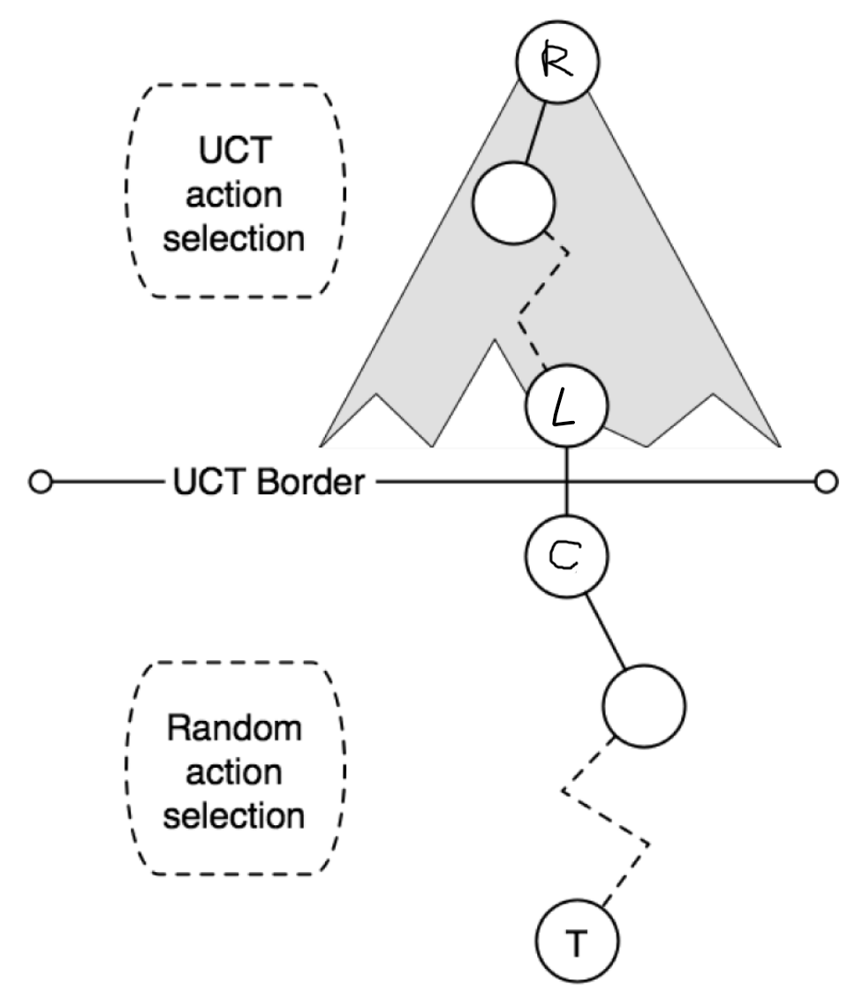
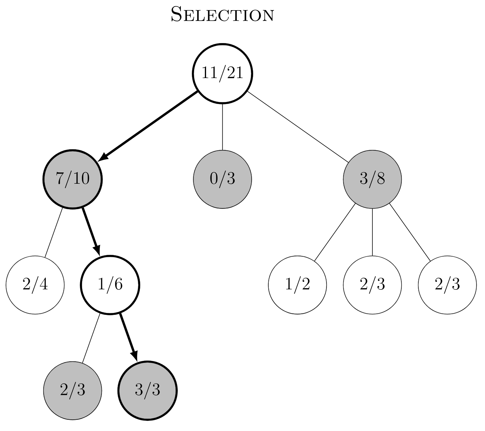
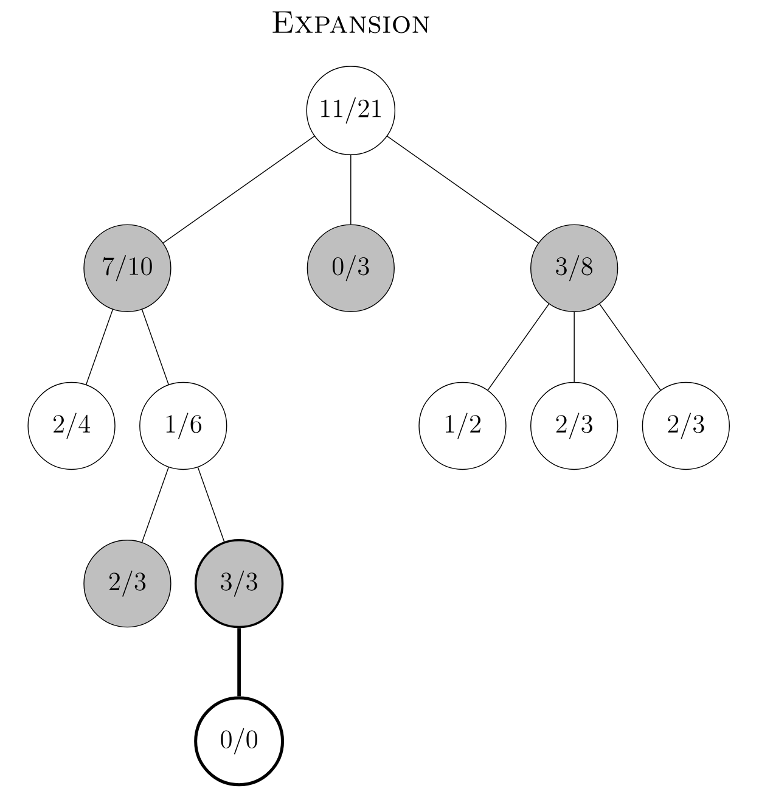
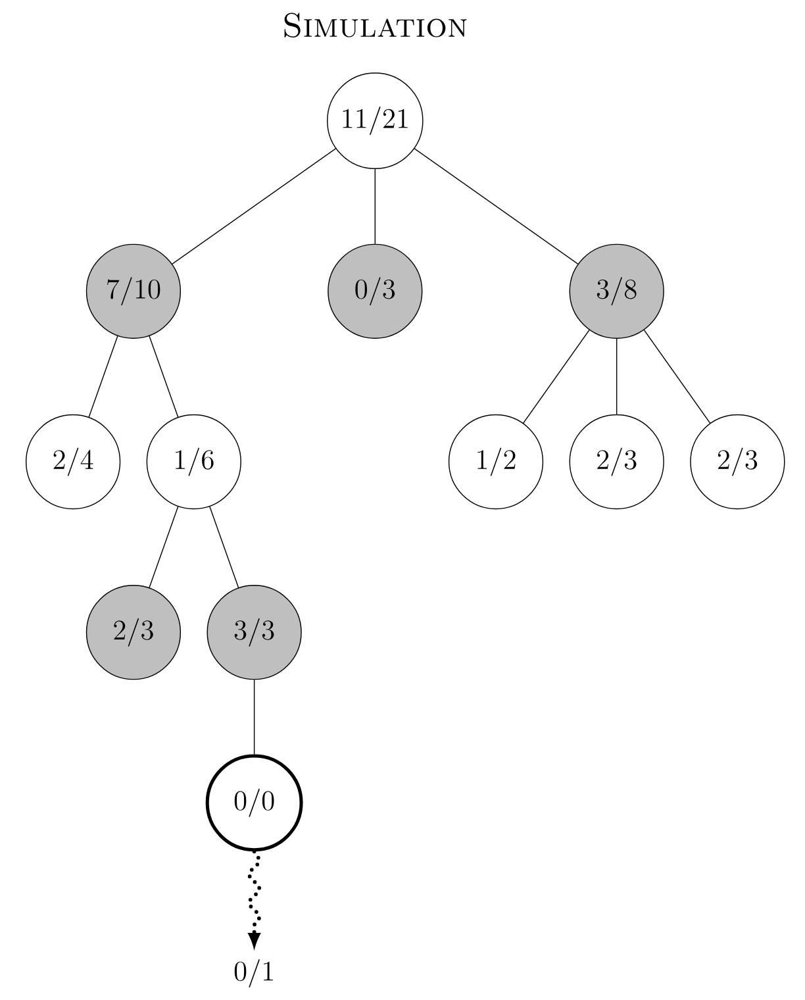
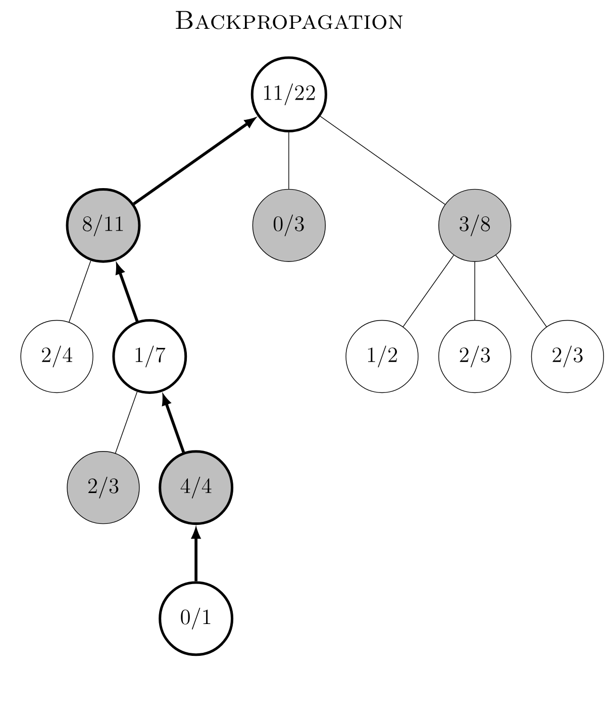

# Theory

## Game Representation

A game tree is a tree data structure, where every node represents a distinct *state* of the game. Given a state $s$, we take an action $a$, and the environment transitions to the new state $s'$ with the transition probability $p_a(s'|s)$. If the transition probablity is $1$ (such as in simple deterministic games like Tic Tac Toe), then each node in the game tree represents a state.

> We use "action" and "move" interchangeably in the context of games


- The *root* of the game tree represents the initial state of the game
- Any transition from one state to another consists a *move*
- The game ends at a terminal node

## Monte Carlo Tree Search



*Taken from CadiaPlayer*

Our game tree contains various connected game states, with each node in the tree containing statistics used to compute the value of a particular state. During "training", MCTS traverses down the game tree until a leaf node $L$, then expands the game tree by adding a child node $C$.

After expanding the game tree, we simulate the game from the child node until game termination at $T$ - a *rollout*. The results of the rollout is then used to update the game tree, so that we can choose better nodes to do rollouts from next time.

This way we make the game tree contain better estimates of the values of each states, which allows us to make better actions when we actually play the game

### Selection



> The bold circles contain the nodes selected using the tree policy UCT. The color of the node represent whose turn it is to move next. The numbers in the nodes represent the statistics of the node. For example, a black circle with $7/10$ means black to move next, $7$ wins played from this state, total of $10$ visits at this state. Hence if there are no draws, white would have won $3$ times from this node.

The first phase, selection, works by starting at the root $R$ (initial state of game) and traversing down the game tree using the *tree policy* until a leaf node $L$. The tree policy used here is *Upper Confidence Trees* (UCT), which is UCB1 applied to trees:

$$
a = \arg\max_{a \in A(s)} \left\{ Q(s,a) + C_p\sqrt{\frac{\ln N(s)}{N(s,a)}} \right\}
$$

where $N(s)$ is the number of times a node has been visited, $N(s,a)$ is the number of times $a$ has been selected from this node, and $C_p$ is a exploration constant. Increasing $C_p$ will encourage more exploration, while decreasing it encourages a more greedy approach, but $\sqrt2$ is often chosen.

If the transition probability is 1 - taking an action will deterministically move the state to another - then UCT simplifies to

$$
UCT(v) = \arg\max_{i} \left\{ \frac{w(v_i)}{N(v_i)} + C_p \sqrt{\frac{\ln N(v) }{N(v_i)}} \right\}
$$

for a parent node $v$, child node $v_i$, and number of wins $w$ from this child node $v_i$. UCT It is a sum of two components – the first component of our function \( \frac{w(v_i)}{N(v_i)} \), also called exploitation component, can be read as a winning/rate. The term on the right is the exploration component - encouraging child nodes that have little visits. During selection, we want to allow some exploration, hence $C_p>0$ here.

> A leaf node $L$ here is a node in the game tree, where not all actions have been explored. In other words, it still has unexplored game states (if one action transitions to a state deterministically). Once a leaf node has no more unexplored actions, it is *fully expanded*

### Expansion



> $3/3$ still has unexplored actions, hence we add a child node to it. This action then becomes "explored"

The second phase expansion occurs when we've selected a leaf node $L$ to expand on. An unexplored node is randomly chosen, and is added to the game tree as a child node.

### Simulation



> Once the new child is added to the tree, we do one rollout from the $0/0$ until game termination

We do one simulation (rollout) from the new child node $C$ until game termination, where moves are chosen according to the rollout policy. This rollout policy is often completely random.

### Backpropagation



> We can see only black nodes have their win count updated.

After the simulation reaches an end, all of the nodes taken in this path are updated. All of the nodes number of visits are incremented by one each, and the colour that matches the winner will have its win count incremented by 1. Hence useful statistics to keep are the number of visits and win count for that player.

> In this repo, we store the win counts of both players in each node. A node also stores the board state, which contains which player it is to move next

### PseudoCode

```
def select(node):
    while node is not terminal:
        if node is not fully expanded (has unexplored actions):
            return node
        else:
            node = UCT(node)
    return node

def expand(node):
    assert unexplored_actions>0
    action = unexplored_actions.pop()
    add this action as a child (to the game tree)
    return child

def simulate(node):
    while state is not terminal
        choose an action (rollout policy)
        move the state
    return the result of game

def backpropagate(node,result):
    update this node
    if parent exists:
        backpropagate(parent,result)

def UCT(node,c):
    choices = (child.value/child.visits)+ c*np.sqrt((np.log(parent.visits)/child.visits))
    return node.children[argmax(choices)]

def train(root):
    leaf=select(root)
    if leaf has unexplored actions:
        child=expand(leaf)
        reward=simulate(child)
        backpropagate(child,reward)
    else:
        reward=simulate(leaf)
        backpropagate(leaf, reward)
```